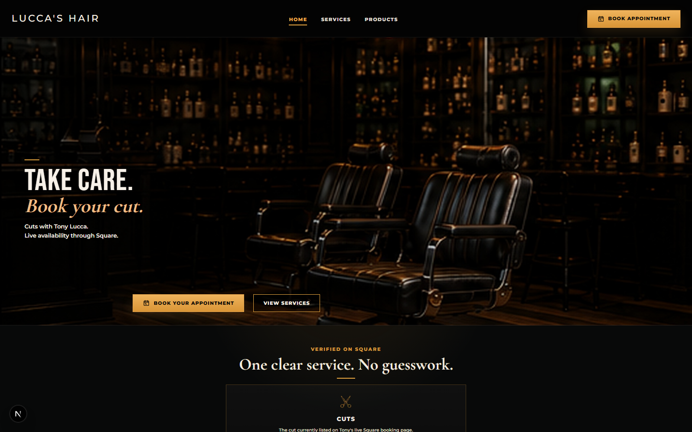
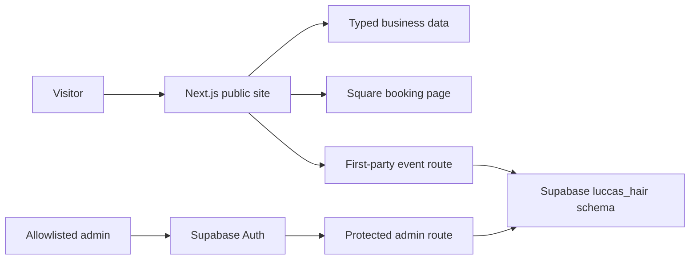
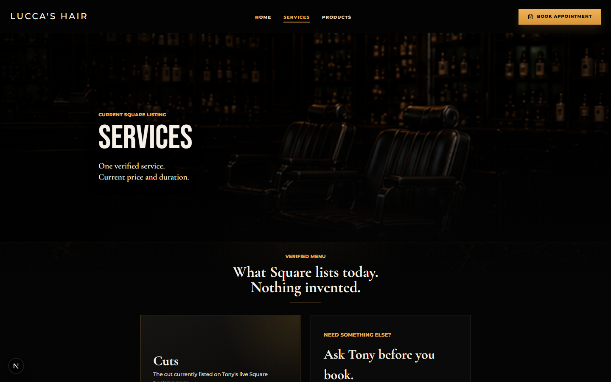

# Lucca's Hair

[](https://github.com/YuvrajKashyap/luccas-hair/actions/workflows/ci.yml)

[Live site](https://luccas-hair.vercel.app) · [Square booking](https://square.site/book/DT4HT5QD699RJ/lucca) · [Architecture](docs/architecture.md) · [Data provenance](docs/data-provenance.md)

An appointment-first website for a working stylist that turns a scattered local-business journey into one trustworthy path: see the verified service, check the facts, and book on Square.



## The work

|                  |                                                                                                  |
| ---------------- | ------------------------------------------------------------------------------------------------ |
| Product          | Live client website for Tony Lucca in The Colony, Texas                                          |
| Role             | Product strategy, UX, visual design, frontend engineering, data verification, QA, and deployment |
| Primary user job | Find the current service and reserve an available time                                           |
| Core constraint  | Improve the custom experience without replacing or risking the working Square booking system     |
| Outcome          | A responsive, production-deployed booking front door with a direct Square handoff                |

The repository is intentionally honest about what the business has confirmed. As of July 17, 2026, Tony's live Square page lists one service, **Cuts**, at **$20** for **20 minutes**. Unconfirmed services, policies, product inventory, client photos, reviews, and address fragments are not presented as fact.

## What changed

- Reframed every primary call to action around live Square availability.
- Preserved `/book` as a compatibility redirect so old links keep working.
- Replaced placeholder service claims with the one current Square listing.
- Added current opening hours and accurate local-business structured data.
- Removed misleading cart, policy, social, walk-in, suite, founding-year, and product claims.
- Made the private admin surface fail closed when Supabase is not configured.
- Added safe internal auth redirects to prevent open-redirect behavior.
- Added Vitest coverage for business facts, redirects, and SEO schema.
- Added a single CI gate for formatting, linting, types, tests, production build, and production-dependency security.
- Upgraded Next.js and React patch releases and resolved the dependency audit to zero known vulnerabilities.

## System design



The custom site owns discovery, trust, SEO, and conversion tracking. Square remains the booking system of record. Supabase is optional for local builds and isolated behind server-side configuration. See [the architecture note](docs/architecture.md) for trust boundaries and failure behavior.

## Key decisions

1. **Handoff, not reimplementation.** A custom scheduler would duplicate availability logic and create risk for a site Tony already uses. The site links directly to the current Square calendar.
2. **Verified data only.** Business data lives in typed modules and is covered by regression tests. Unknowns are omitted or turned into a direct contact path.
3. **Fail closed.** Missing private configuration hides admin routes with a 404. It never exposes a public analytics scaffold.
4. **Concept visuals, factual content.** Atmospheric imagery establishes the brand direction, but the UI explicitly states that it is not a client-work gallery.
5. **Compatibility over churn.** Existing `/book` links still work through a server redirect even though new calls to action point to Square directly.

## Stack

- Next.js 16 App Router, React 19, TypeScript
- Hand-authored responsive CSS with Montserrat, Cormorant Garamond, and Bebas Neue
- Supabase SSR and Auth for the optional private surface
- Vercel Analytics and Speed Insights
- Vitest, ESLint, Prettier, and GitHub Actions
- Vercel deployment with Square as the booking system of record

## Run locally

Requires Node.js 22 or newer.

```bash
npm ci
npm run dev
```

The public site and production build work without secrets. Copy `.env.example` to `.env.local` only when testing an integration.

```bash
npm run verify
```

`verify` runs formatting, linting, TypeScript, 10 regression tests, a production build, and a production-dependency audit. The same command runs in CI.

## Environment

| Variable                               | Purpose                                 | Public site required? |
| -------------------------------------- | --------------------------------------- | --------------------- |
| `NEXT_PUBLIC_SITE_URL`                 | Canonical production URL                | No                    |
| `NEXT_PUBLIC_SQUARE_BOOKING_URL`       | Optional Square booking override        | No                    |
| `NEXT_PUBLIC_SUPABASE_URL`             | Supabase project URL                    | No                    |
| `NEXT_PUBLIC_SUPABASE_PUBLISHABLE_KEY` | Current public Supabase key             | No                    |
| `NEXT_PUBLIC_SUPABASE_ANON_KEY`        | Legacy key fallback                     | No                    |
| `SUPABASE_SERVICE_ROLE_KEY`            | Server-only event persistence           | No                    |
| `ADMIN_EMAIL_ALLOWLIST`                | Emails allowed into the private surface | No                    |

## Data and research

The shipped business facts were checked against Tony's public Square booking page on July 17, 2026. The implementation also follows current primary-source guidance for [Square Bookings](https://developer.squareup.com/docs/bookings-api/what-it-is), [Google local-business structured data](https://developers.google.com/search/docs/appearance/structured-data/local-business), [Supabase redirect URLs](https://supabase.com/docs/guides/auth/redirect-urls), [Supabase SSR](https://supabase.com/docs/guides/auth/server-side/advanced-guide), and [Next.js 16.2](https://nextjs.org/blog/next-16-2).

The precise source, confidence, and update rule for each public fact are documented in [data provenance](docs/data-provenance.md).

## Deliberate limitations

- Square owns live availability, appointment details, rescheduling, and cancellation flows.
- No ecommerce or product inventory is live.
- No client gallery, testimonials, ratings, suite number, postal code, or unverified policies are published.
- The admin and event store remain inactive until valid Supabase configuration is supplied; when connected, the private page summarizes 30-day conversion counts.
- No license is included; this is client work, not a reusable template.

## More proof



- [Verification record](docs/verification.md)
- [Technical implementation](docs/technical-implementation.md)
- [Historical product and design planning](docs/product-blueprint.md)
