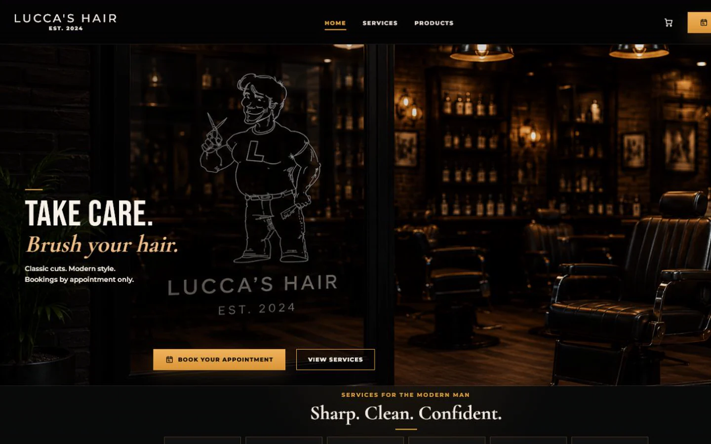

# Lucca's Hair

Lucca's Hair is a premium salon and barber-style website project focused on appointment booking, service presentation, and future product sales.

[Open the live site](https://luccas-hair.vercel.app) · [Book through Square](https://square.site/book/DT4HT5QD699RJ/lucca)

## Product Preview



The homepage keeps booking prominent and hands live appointment availability
off to Square. Its atmospheric imagery establishes the visual direction and is
not presented as a gallery of client work.

## Project Status

The Next.js application is implemented and publicly deployed. Its main customer
journey covers Home, Services, Products, and FAQ / Policies, with appointment
booking handed off to Square. The repository also contains private admin,
analytics, SEO, and deployment foundations. Unconfirmed products and business
details remain intentionally withheld.

## Business Objective

The primary objective is to make it easy and obvious for clients to book appointments with Tony Lucca through Square.

The secondary objective is to showcase and eventually sell hair and grooming products once product, pricing, and fulfillment details are confirmed.

The project should read as real client and product work: brand direction, UX strategy, conversion planning, appointment flow design, commerce planning, technical readiness, and clean documentation.

## MVP Scope

- Home
- Services
- Products
- FAQ / Policies

Booking is handled through the primary Book Appointment CTA, which opens Tony Lucca's Square booking site. There is no standalone `/book`, `/about`, or `/contact` page in the current site scope.

Future scope can include product detail pages, gallery, testimonials, memberships, gift cards, a style journal, and a client portal.

## Planned Technical Direction

- Next.js App Router
- TypeScript
- Tailwind CSS
- Framer Motion
- Supabase for auth, contact submissions, and custom analytics events
- Zod validation
- Vercel Analytics and Speed Insights
- Vercel deployment
- Square booking integration through Tony Lucca's public Square booking URL
- Product or ecommerce flow, TBD

## App Setup

Install dependencies:

```bash
npm install
```

Run the development server:

```bash
npm run dev
```

Run checks:

```bash
npm run lint
npm run typecheck
npm run build
npm run format:check
```

## Environment Variables

Copy `.env.example` to `.env.local` when local integration work begins.

Required later for Supabase and booking integration:

- `NEXT_PUBLIC_SITE_URL`
- `NEXT_PUBLIC_SQUARE_BOOKING_URL`
- `NEXT_PUBLIC_SUPABASE_URL`
- `NEXT_PUBLIC_SUPABASE_PUBLISHABLE_KEY`
- `NEXT_PUBLIC_SUPABASE_ANON_KEY`, optional legacy fallback
- `SUPABASE_SERVICE_ROLE_KEY`, server-only persistence key
- `ADMIN_EMAIL_ALLOWLIST`

## Current Documentation

```text
docs/
  technical-implementation.md
  product-blueprint.md
  sitemap.md
  user-flows.md
  content-requirements.md
  client-questionnaire.md
  mockup-plan.md
  technical-direction.md
  project-brief.md
  roadmap.md
  client-notes.md
  context/
    build-context.md
  brand/
    brand-foundation.md
  design/
    design-system-notes.md
    mockup-notes.md
  decisions/
    0001-project-name-and-repo-direction.md
    0002-phase-based-build-process.md
    0003-product-blueprint-and-mvp-scope.md

assets/
  references/
  logo/
  mockups/
  products/

src/
  app/
  components/
  data/
  lib/
  server/
  styles/
  types/

supabase/
  migration-drafts/
```

## Next Step

Generate and review page mockups in the approved order, lock one selected visual direction per page, collect missing client details, and replace placeholder pages with final UI after assets are approved.

## Business Details Policy

Business details that have not been confirmed must stay marked as `TBD`. Do not fabricate final services, prices, products, policies, logo assets, domain, social links, or ecommerce details.
