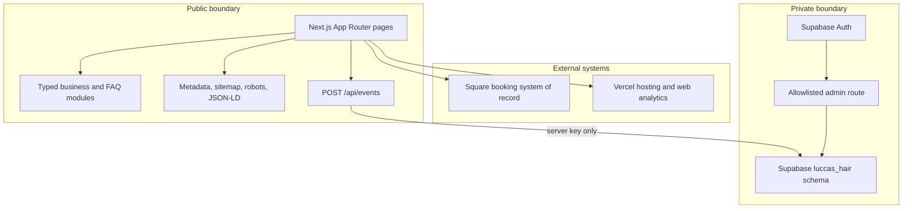

# Architecture

## Objective

Keep the public experience custom and trustworthy while leaving booking state in the system Tony already operates. The site is a conversion and information layer, not a second calendar.

## Request flows

### Book an appointment

1. A visitor lands on a statically rendered public page.
2. The UI reads service, hours, address, and contact facts from typed modules.
3. A booking click emits a first-party conversion event when persistence is configured.
4. The browser opens Tony's public Square page, which owns live times and appointment state.

The legacy `/book` route performs the same Square handoff with a server redirect.

### Private access

1. Supabase and an email allowlist must both be configured.
2. Supabase sends and verifies the authentication link.
3. Redirect destinations pass through an internal-path allowlist.
4. The server confirms both the session and allowlist membership.
5. Missing configuration or an unauthorized session never renders private content.

## Failure behavior

| Condition | Behavior |
| --- | --- |
| Square override absent | Use the verified public Square URL |
| Supabase absent | Public pages build normally; admin routes return 404; event persistence is skipped |
| Invalid auth redirect | Fall back to `/admin` |
| Unknown business fact | Omit it or direct the user to Tony; do not publish a placeholder as truth |
| JavaScript unavailable | Server-rendered content and direct links remain usable |

## Ownership boundaries

- **Next.js:** presentation, content hierarchy, SEO, route compatibility, and conversion intent.
- **Square:** service availability, appointment details, and booking lifecycle.
- **Supabase:** optional private authentication and first-party event persistence.
- **Vercel:** hosting, deployment, aggregate web analytics, and performance signals.

This split keeps the blast radius small: a portfolio or UI change cannot modify Tony's actual calendar.
